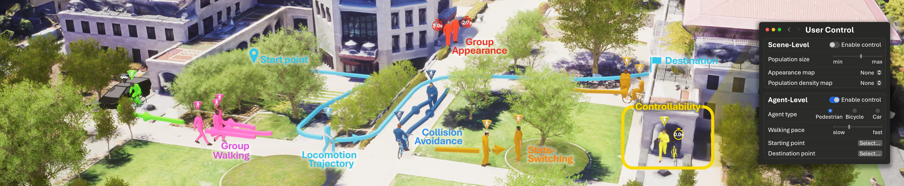

<h2 align="center">Continuous Locomotive Crowd Behavior Generation</h2>
<p align="center">
  <a href="https://InhwanBae.github.io/"><strong>Inhwan Bae</strong></a>
  ·  
  <a href="https://leejunoh.com/"><strong>Junoh Lee</strong></a>
  ·
  <a href="https://sites.google.com/site/hgjeoncv/"><strong>Hae-Gon Jeon</strong></a>
  <br>
  CVPR 2025
</p>

<p align="center">
  <a href="https://inhwanbae.github.io/publication/crowdes/"><strong><code>Project Page</code></strong></a>
  <a href="https://arxiv.org/abs/2504.04756"><strong><code>CVPR Paper</code></strong></a>
  <a href="https://github.com/InhwanBae/Crowd-Behavior-Generation"><strong><code>Source Code</code></strong></a>
  <a href="#-citation"><strong><code>Related Works</code></strong></a>
</p>

<div align='center'>
  <br>
  <br>An overview of our CrowdES framework.
</div>


### Comming Soon!


<br>

## 📖 Citation
If you find this code useful for your research, please cite our trajectory prediction papers :)

[**`🏢🚶‍♂️ CrowdES (CVPR'25) 🏃‍♀️🏠`**](https://github.com/InhwanBae/Crowd-Behavior-Generation) **|**
[**`💬 LMTrajectory (CVPR'24) 🗨️`**](https://github.com/InhwanBae/LMTrajectory) **|**
[**`1️⃣ SingularTrajectory (CVPR'24) 1️⃣`**](https://github.com/InhwanBae/SingularTrajectory) **|**
[**`🌌 EigenTrajectory (ICCV'23) 🌌`**](https://github.com/InhwanBae/EigenTrajectory) **|** 
[**`🚩 Graph‑TERN (AAAI'23) 🚩`**](https://github.com/InhwanBae/GraphTERN) **|**
[**`🧑‍🤝‍🧑 GP‑Graph (ECCV'22) 🧑‍🤝‍🧑`**](https://github.com/InhwanBae/GPGraph) **|**
[**`🎲 NPSN (CVPR'22) 🎲`**](https://github.com/InhwanBae/NPSN) **|**
[**`🧶 DMRGCN (AAAI'21) 🧶`**](https://github.com/InhwanBae/DMRGCN)

```bibtex
@inproceedings{bae2025crowdes,
  title={Continuous Locomotive Crowd Behavior Generation},
  author={Bae, Inhwan and Lee, Junoh and Jeon, Hae-Gon},
  booktitle={Proceedings of the IEEE/CVF Conference on Computer Vision and Pattern Recognition},
  year={2025}
}
```
<details open>
  <summary>More Information (Click to expand)</summary>

```bibtex
@inproceedings{bae2024lmtrajectory,
  title={Can Language Beat Numerical Regression? Language-Based Multimodal Trajectory Prediction},
  author={Bae, Inhwan and Lee, Junoh and Jeon, Hae-Gon},
  booktitle={Proceedings of the IEEE/CVF Conference on Computer Vision and Pattern Recognition},
  year={2024}
}

@inproceedings{bae2024singulartrajectory,
  title={SingularTrajectory: Universal Trajectory Predictor Using Diffusion Model},
  author={Bae, Inhwan and Park, Young-Jae and Jeon, Hae-Gon},
  booktitle={Proceedings of the IEEE/CVF Conference on Computer Vision and Pattern Recognition},
  year={2024}
}

@inproceedings{bae2023eigentrajectory,
  title={EigenTrajectory: Low-Rank Descriptors for Multi-Modal Trajectory Forecasting},
  author={Bae, Inhwan and Oh, Jean and Jeon, Hae-Gon},
  booktitle={Proceedings of the IEEE/CVF International Conference on Computer Vision},
  year={2023}
}

@article{bae2023graphtern,
  title={A Set of Control Points Conditioned Pedestrian Trajectory Prediction},
  author={Bae, Inhwan and Jeon, Hae-Gon},
  journal={Proceedings of the AAAI Conference on Artificial Intelligence},
  year={2023}
}

@inproceedings{bae2022gpgraph,
  title={Learning Pedestrian Group Representations for Multi-modal Trajectory Prediction},
  author={Bae, Inhwan and Park, Jin-Hwi and Jeon, Hae-Gon},
  booktitle={Proceedings of the European Conference on Computer Vision},
  year={2022}
}

@inproceedings{bae2022npsn,
  title={Non-Probability Sampling Network for Stochastic Human Trajectory Prediction},
  author={Bae, Inhwan and Park, Jin-Hwi and Jeon, Hae-Gon},
  booktitle={Proceedings of the IEEE/CVF Conference on Computer Vision and Pattern Recognition},
  year={2022}
}

@article{bae2021dmrgcn,
  title={Disentangled Multi-Relational Graph Convolutional Network for Pedestrian Trajectory Prediction},
  author={Bae, Inhwan and Jeon, Hae-Gon},
  journal={Proceedings of the AAAI Conference on Artificial Intelligence},
  year={2021}
}
```
</details>

<br>
