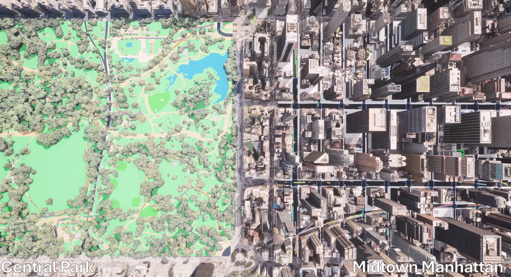
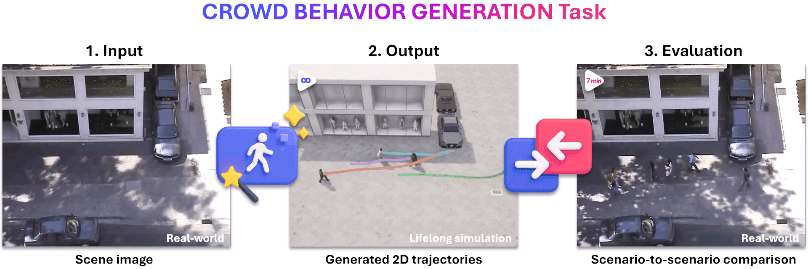

<h2 align="center">Continuous Locomotive Crowd Behavior Generation</h2>
<p align="center">
  <a href="https://InhwanBae.github.io/"><strong>Inhwan Bae</strong></a>
  ·  
  <a href="https://leejunoh.com/"><strong>Junoh Lee</strong></a>
  ·
  <a href="https://sites.google.com/site/hgjeoncv/"><strong>Hae-Gon Jeon</strong></a>
  <br>
  CVPR 2025
</p>

<p align="center">
  <a href="https://inhwanbae.github.io/publication/crowdes/"><strong><code>Project Page</code></strong></a>
  <a href="https://arxiv.org/abs/2504.04756"><strong><code>CVPR Paper</code></strong></a>
  <a href="https://github.com/InhwanBae/Crowd-Behavior-Generation"><strong><code>Source Code</code></strong></a>
  <a href="#-citation"><strong><code>Related Works</code></strong></a>
</p>

<div align='center'>
  <br>
  <br>Generating realistic, continuous crowd behaviors with learned dynamics.
  <br><br>
  
  <br>(Left) Time-varying behavior changes, (Right) Real2Sim evaluation on New York City.
  <br>More video examples are available on our <a href="https://inhwanbae.github.io/publication/crowdes/">project page</a>!
</div>

<br>**Summary**: A **crowd emitter diffusion model** and a **state-switching crowd simulator** for **populating** input scene images and **generating** lifelong crowd trajectories.

<br>

## 🏢🚶‍♂️ Crowd Behavior Generation Benchmark 🏃‍♀️🏠

<div align='center'>
  
</div>

<br>

* **Repurposed Trajectory Datasets**: A new benchmark that reuses existing real-world human trajectory datasets, adapting them for crowd trajectory generation.
* **Image-Only Input**: Eliminates conventional observation trajectory dependency and requires only a single input image to fully populate the scene with crowds.
* **Lifelong Simulation**: Generates continuous trajectories where people dynamically enter and exit the scene, replicating the ever-changing real-world crowd dynamics.
* **Two-Tier Evaluation**: Assesses performance on both scene-level realism (e.g., density, frequency, coverage, and population metrics) and agent-level accuracy (e.g., kinematics, DTW, diversity, and collision rate).

<br>

## 🚵 CrowdES Framework 🚵

<div align='center'>
  
</div>
<br>

* **Crowd Emitter**: A diffusion-based model that iteratively “emits” new agents by sampling when and where they appear on spatial layouts.
* **Crowd Simulator**: A state-switching system that generates continuous trajectories with agents dynamically switching behavior modes.
* **Controllability & Flexibility**: Users can override or customize scene-level and agent-level parameters at runtime.
* **Sim2Real & Real2Sim Capability**: The framework can bridge synthetic and real-world scenarios for interdisciplinary research.

<br>

## Model Training
### Setup
**Environment**
<br>All models were trained and tested on Ubuntu 20.04 with Python 3.10 and PyTorch 2.2.2 with CUDA 12.1. You can install all dependencies via following command:
```bash
pip install -r requirements.txt
```

**Dataset**
<br>Preprocessed [ETH](https://data.vision.ee.ethz.ch/cvl/aem/ewap_dataset_full.tgz), [UCY](https://graphics.cs.ucy.ac.cy/research/downloads/crowd-data), [SDD](http://vatic2.stanford.edu/stanford_campus_dataset.zip) and [EDIN](https://homepages.inf.ed.ac.uk/rbf/FORUMTRACKING/) datasets are [released](https://github.com/InhwanBae/Crowd-Behavior-Generation/releases) in this repository.

If you want to preprocess the datasets by yourself, please download the [raw datasets](https://github.com/InhwanBae/Crowd-Behavior-Generation/releases) and run the following command:
```bash
python utils/preprocess_dataset.py --model_config <path_to_model_config>

# Example
python utils/preprocess_dataset.py --model_config ./configs/model/CrowdES_eth.yaml
python utils/preprocess_dataset.py --model_config ./configs/model/CrowdES_hotel.yaml
python utils/preprocess_dataset.py --model_config ./configs/model/CrowdES_univ.yaml
python utils/preprocess_dataset.py --model_config ./configs/model/CrowdES_zara1.yaml
python utils/preprocess_dataset.py --model_config ./configs/model/CrowdES_zara2.yaml
python utils/preprocess_dataset.py --model_config ./configs/model/CrowdES_sdd.yaml
python utils/preprocess_dataset.py --model_config ./configs/model/CrowdES_gcs.yaml
python utils/preprocess_dataset.py --model_config ./configs/model/CrowdES_edin.yaml
```

### Train Crowd Emitter Model
To train the CrowdES crowd emitter model, you can use the following command:
```bash
python trainval.py --model_train emitter_pre --model_config <path_to_model_config>
python trainval.py --model_train emitter --model_config <path_to_model_config>

# Example
python trainval.py --model_train emitter_pre --model_config ./configs/model/CrowdES_eth.yaml
python trainval.py --model_train emitter --model_config ./configs/model/CrowdES_eth.yaml
```

### Train Crowd Simulator Model
To train the CrowdES crowd simulator model, you can use the following command:
```bash
python trainval.py --model_train simulator --model_config <path_to_model_config>

# Example
python trainval.py --model_train simulator --model_config ./configs/model/CrowdES_eth.yaml
```

<br>

## Model Evaluation
### Pretrained Models
We provide pretrained models in the [**release section**](https://github.com/InhwanBae/Crowd-Behavior-Generation/releases). 


### Evaluate CrowdES
To evaluate the CrowdES model, you can use the following command:
```bash
python trainval.py --test --model_config <path_to_model_config>

# Example
python trainval.py --test --model_config ./configs/model/CrowdES_eth.yaml
```

### Evaluate CrowdES with Custom Input
To evaluate the CrowdES model with a custom input image, you can use the following command:
```bash
python trainval.py --synthetic --model_config <path_to_model_config>

# Example
python trainval.py --synthetic --model_config ./configs/model/CrowdES_eth.yaml
```

<br>

## 3D Visualization
To visualize the generated crowd behaviors in 3D, we provide a visualization toolkit based on the CARLA simulator. Please follow the instructions in the [3D_Visualization_Toolkit/README](https://github.com/InhwanBae/Crowd-Behavior-Generation/blob/main/3D_Visualization_Toolkit/README.md) file to set up the environment and visualize the results.

<br>

## 📖 Citation
If you find this code useful for your research, please cite our trajectory prediction papers :)

[**`🏢🚶‍♂️ CrowdES (CVPR'25) 🏃‍♀️🏠`**](https://github.com/InhwanBae/Crowd-Behavior-Generation) **|**
[**`💬 LMTrajectory (CVPR'24) 🗨️`**](https://github.com/InhwanBae/LMTrajectory) **|**
[**`1️⃣ SingularTrajectory (CVPR'24) 1️⃣`**](https://github.com/InhwanBae/SingularTrajectory) **|**
[**`🌌 EigenTrajectory (ICCV'23) 🌌`**](https://github.com/InhwanBae/EigenTrajectory) **|** 
[**`🚩 Graph‑TERN (AAAI'23) 🚩`**](https://github.com/InhwanBae/GraphTERN) **|**
[**`🧑‍🤝‍🧑 GP‑Graph (ECCV'22) 🧑‍🤝‍🧑`**](https://github.com/InhwanBae/GPGraph) **|**
[**`🎲 NPSN (CVPR'22) 🎲`**](https://github.com/InhwanBae/NPSN) **|**
[**`🧶 DMRGCN (AAAI'21) 🧶`**](https://github.com/InhwanBae/DMRGCN)

```bibtex
@inproceedings{bae2025crowdes,
  title={Continuous Locomotive Crowd Behavior Generation},
  author={Bae, Inhwan and Lee, Junoh and Jeon, Hae-Gon},
  booktitle={Proceedings of the IEEE/CVF Conference on Computer Vision and Pattern Recognition},
  year={2025}
}
```
<details open>
  <summary>More Information (Click to expand)</summary>

```bibtex
@inproceedings{bae2024lmtrajectory,
  title={Can Language Beat Numerical Regression? Language-Based Multimodal Trajectory Prediction},
  author={Bae, Inhwan and Lee, Junoh and Jeon, Hae-Gon},
  booktitle={Proceedings of the IEEE/CVF Conference on Computer Vision and Pattern Recognition},
  year={2024}
}

@inproceedings{bae2024singulartrajectory,
  title={SingularTrajectory: Universal Trajectory Predictor Using Diffusion Model},
  author={Bae, Inhwan and Park, Young-Jae and Jeon, Hae-Gon},
  booktitle={Proceedings of the IEEE/CVF Conference on Computer Vision and Pattern Recognition},
  year={2024}
}

@inproceedings{bae2023eigentrajectory,
  title={EigenTrajectory: Low-Rank Descriptors for Multi-Modal Trajectory Forecasting},
  author={Bae, Inhwan and Oh, Jean and Jeon, Hae-Gon},
  booktitle={Proceedings of the IEEE/CVF International Conference on Computer Vision},
  year={2023}
}

@article{bae2023graphtern,
  title={A Set of Control Points Conditioned Pedestrian Trajectory Prediction},
  author={Bae, Inhwan and Jeon, Hae-Gon},
  journal={Proceedings of the AAAI Conference on Artificial Intelligence},
  year={2023}
}

@inproceedings{bae2022gpgraph,
  title={Learning Pedestrian Group Representations for Multi-modal Trajectory Prediction},
  author={Bae, Inhwan and Park, Jin-Hwi and Jeon, Hae-Gon},
  booktitle={Proceedings of the European Conference on Computer Vision},
  year={2022}
}

@inproceedings{bae2022npsn,
  title={Non-Probability Sampling Network for Stochastic Human Trajectory Prediction},
  author={Bae, Inhwan and Park, Jin-Hwi and Jeon, Hae-Gon},
  booktitle={Proceedings of the IEEE/CVF Conference on Computer Vision and Pattern Recognition},
  year={2022}
}

@article{bae2021dmrgcn,
  title={Disentangled Multi-Relational Graph Convolutional Network for Pedestrian Trajectory Prediction},
  author={Bae, Inhwan and Jeon, Hae-Gon},
  journal={Proceedings of the AAAI Conference on Artificial Intelligence},
  year={2021}
}
```
</details>

<br>
